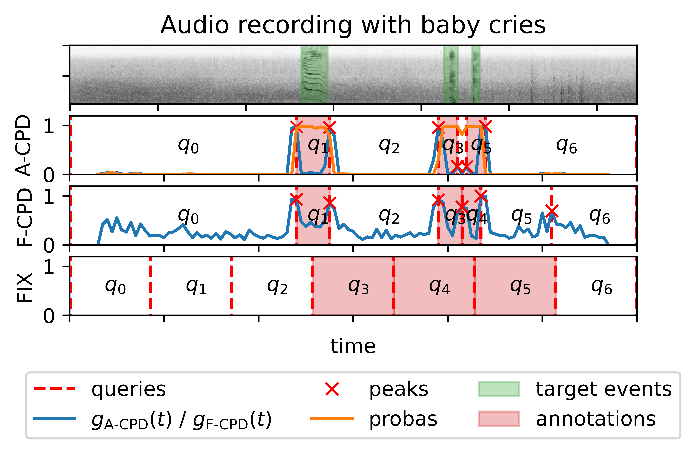

# A-CPD: From Weak to Strong Sound Event Labels using Adaptive Change-Point Detection and Active Learning

__TODO__: update with arXiv link (soon).
__TODO__: update with Zenodo links (soon).

Official PyTorch implementation of the A-CPD method presented in the paper [From Weak to Strong Sound Event Labels using Adaptive Change-Point Detection and Active Learning](https://arxiv.org), by [John Martinsson](https://johnmartinsson.github.io), [Olof Mogren](https://mogren.one), [Maria Sandsten](https://www.maths.lu.se/english/research/staff/mariasandsten/), and [Tuomas Virtanen](https://homepages.tuni.fi/tuomas.virtanen/)

Currently under review for EUSIPCO 2024. Cite as:

    @article{Martinsson2024,
      title={From Weak to Strong Sound Event Labels using Adaptive Change-Point Detection and Active Learning},
      author={Martinsson, John and Mogren, Olof and Sandsten, Maria and Virtanen, Tuomas},
      journal={arXiv preprint arXiv:...},
      year={2024}
    }

## Produce figures and tables
    # download the experiments
    # TODO
    wget <zenodo>/results_eusipco_2024.zip
    unzip results_eusipco_2024.zip

    # produces all tables in the paper
    python src/tables.py

    # produces all figures in the paper
    python src/figures.py

The figures are saved to the directory

    ./results/figures_reproduced

## Run experiments on the pre-generated datasets
This section explains how to reproduce the EUSIPCO 2024 results, they will be put in the directory

    results/eusipco_2024_reproduced

### Download data and pre-computed embeddings

    wget <zenodo>/data.zip
    unzip data.zip
    
The pre-computed embeddings and labels for the generated datasets will now be in

    ./data/
    
This is the minimum requirement to run the simulations.

### Setup environment

    pip3 install torch torchvision torchaudio --index-url https://download.pytorch.org/whl/cu118
    pip3 install -r requirements.txt

### Run experiments

    python src/main.py

The results of the experiment will be in

    ./results/eusipco_2024_reproduced

### Produce figures and tables

Please update the config.py script after this and change

    results_dir : eusipco_2024 # to
    results_dir : eusipco_2024_reproduced

Then produce the figures and tables in the same way as described above. If you do not change this line, the produced figures and tables will be from the uploaded eusipco_2024 results.

## Run experiments on generated datasets
A description on how to download all the audio source material and how to use the scripts to generate the datasets and compute the embeddings using BirdNET will be made available upon demand. Please contact the main author of the paper.
